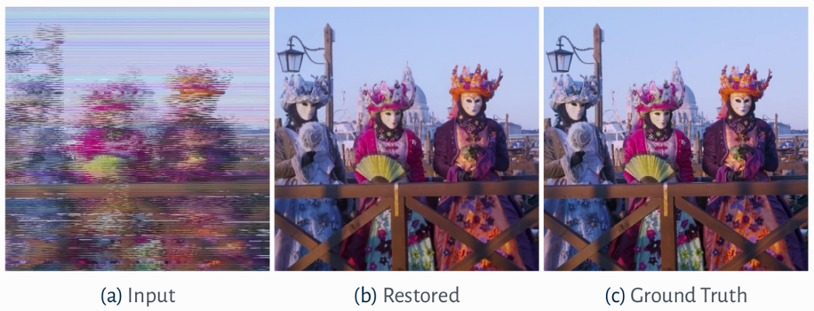

# Restoration of Analog Videos Using Swin-UNet

## Table of Contents


* [About the Project](#about-the-project)
* [Getting Started](#getting-started)
  * [Prerequisites](#prerequisites)
  * [Installation](#installation)
* [Usage](#usage)
* [Authors](#authors)
* [Citation](#citation)

## About The Project



This is the **official repository** of "[**Restoration of Analog Videos Using Swin-UNet**](https://dl.acm.org/doi/10.1145/3503161.3547730)" **[Demo ACM MM 2022]**.

In this work, we present a system to restore analog videos of historical archives. These videos often contain severe visual degradation due to the deterioration of their tape supports that require costly and slow manual interventions to recover the original content. The proposed system uses a multi-frame approach and is able to deal also with severe tape mistracking, which results in completely scrambled frames. Tests on real-world videos from a major historical video archive show the effectiveness of our demo system.


## Getting Started

To get a local copy up and running follow these simple steps.

### Prerequisites

We strongly recommend the use of the [**Anaconda**](https://www.anaconda.com/) package manager in order to avoid dependency/reproducibility problems.
A conda installation guide for Linux systems can be found [here](https://docs.conda.io/projects/conda/en/latest/user-guide/install/linux.html)

### Installation
 
1. Clone the repo
```sh
git clone https://github.com/miccunifi/analog-video-restoration.git
```
2. Install Python dependencies **TODO: Copiare requirements.txt**
```sh

```
3.

## Usage

1. Extract the frames of the video in jpg images and save them in a folder **TODO: Inserire comando ffmpeg**

2. **TODO: Upload modello su Drive**

3. **TODO: Modificare codice per fare inferenza su un solo video**


## Authors
* [**Lorenzo Agnolucci**](https://scholar.google.com/citations?user=hsCt4ZAAAAAJ&hl=en)
* [**Leonardo Galteri**](https://scholar.google.com/citations?user=_n2R2bUAAAAJ&hl=en)
* [**Marco Bertini**](https://scholar.google.it/citations?user=SBm9ZpYAAAAJ&hl=en)
* [**Alberto Del Bimbo**](https://scholar.google.it/citations?user=bf2ZrFcAAAAJ&hl=en)

## Citation
If you find this work useful for your research, please consider citing:
<pre>
@inproceedings{10.1145/3503161.3547730,
  author = {Agnolucci, Lorenzo and Galteri, Leonardo and Bertini, Marco and Del Bimbo, Alberto},
  title = {Restoration of Analog Videos Using Swin-UNet},
  year = {2022},
  isbn = {9781450392037},
  publisher = {Association for Computing Machinery},
  address = {New York, NY, USA},
  url = {https://doi.org/10.1145/3503161.3547730},
  doi = {10.1145/3503161.3547730},
  abstract = {In this paper we present a system to restore analog videos of historical archives. These videos often contain severe visual degradation due to the deterioration of their tape supports that require costly and slow manual interventions to recover the original content. The proposed system uses a multi-frame approach and is able to deal also with severe tape mistracking, which results in completely scrambled frames. Tests on real-world videos from a major historical video archive show the effectiveness of our demo system.},
  booktitle = {Proceedings of the 30th ACM International Conference on Multimedia},
  pages = {6985–6987},
  numpages = {3},
  keywords = {old videos restoration, analog videos, unet, swin transformer},
  location = {Lisboa, Portugal},
  series = {MM '22}
}
</pre>
